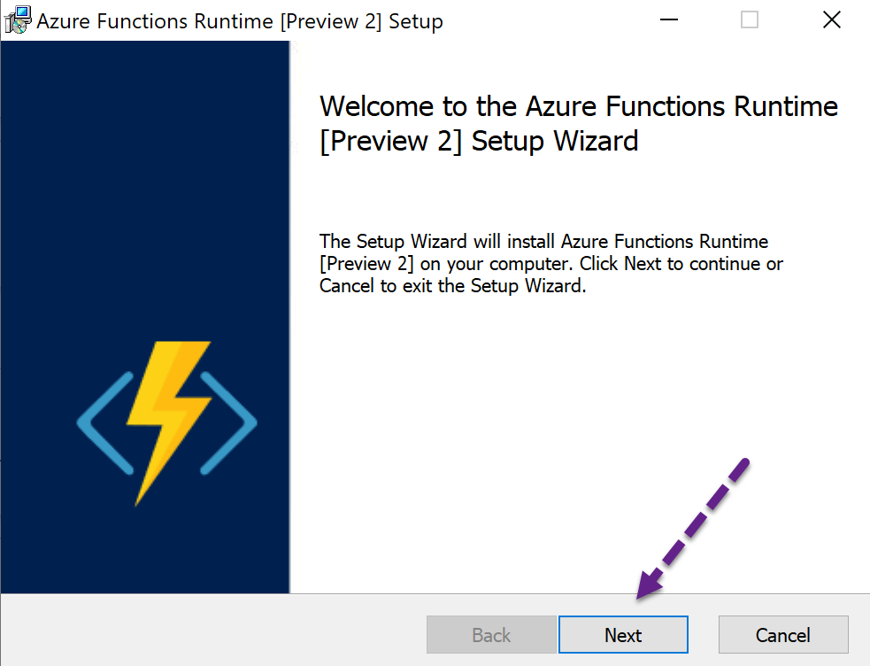
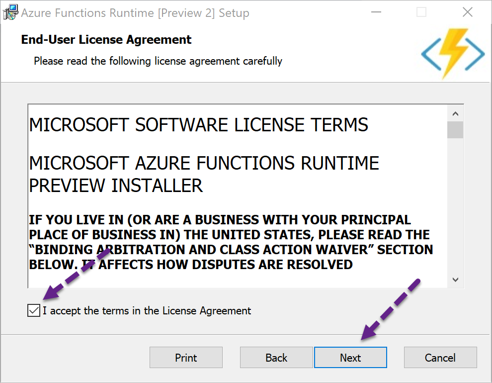
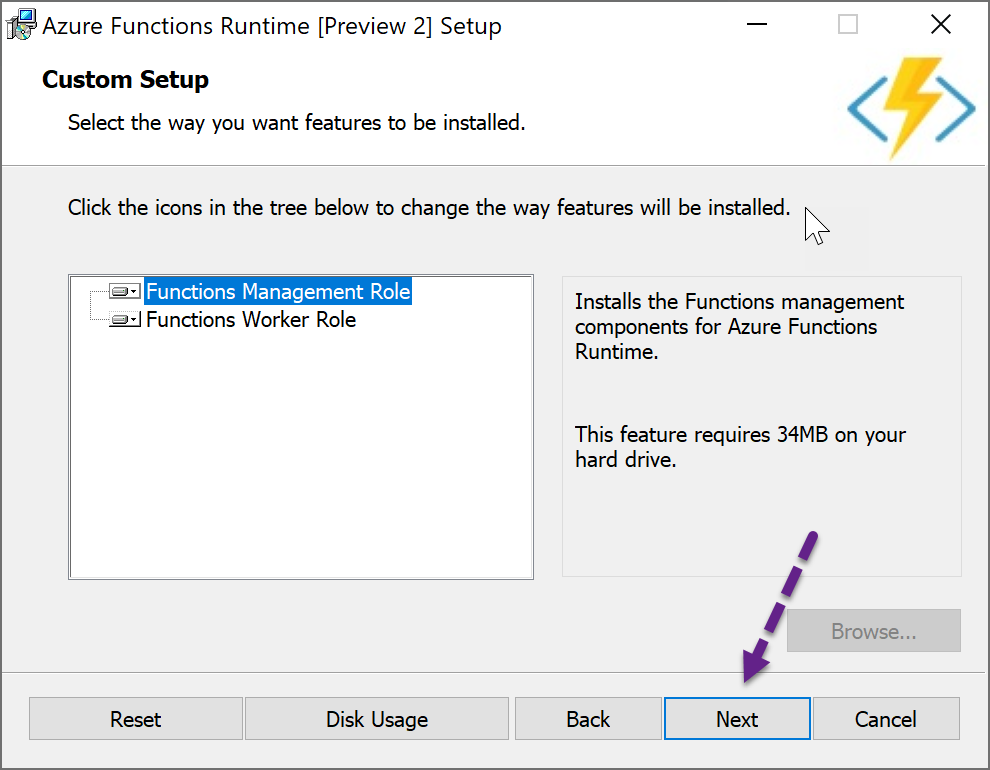
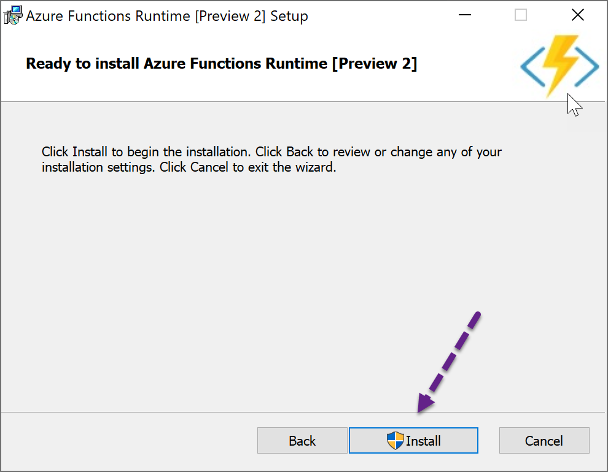
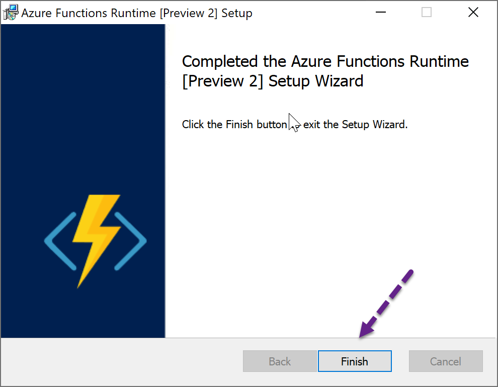

# Running the Azure Function Runtime Installer
###### We will use SQL Express for this session

This is basically a click Next exercise.

Accept the License Agreement

Your machine will need to restart, so save all open documents.

# Configuring the Runtime
