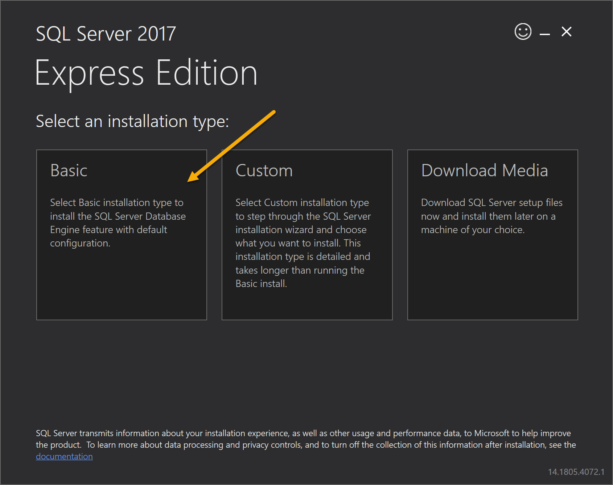
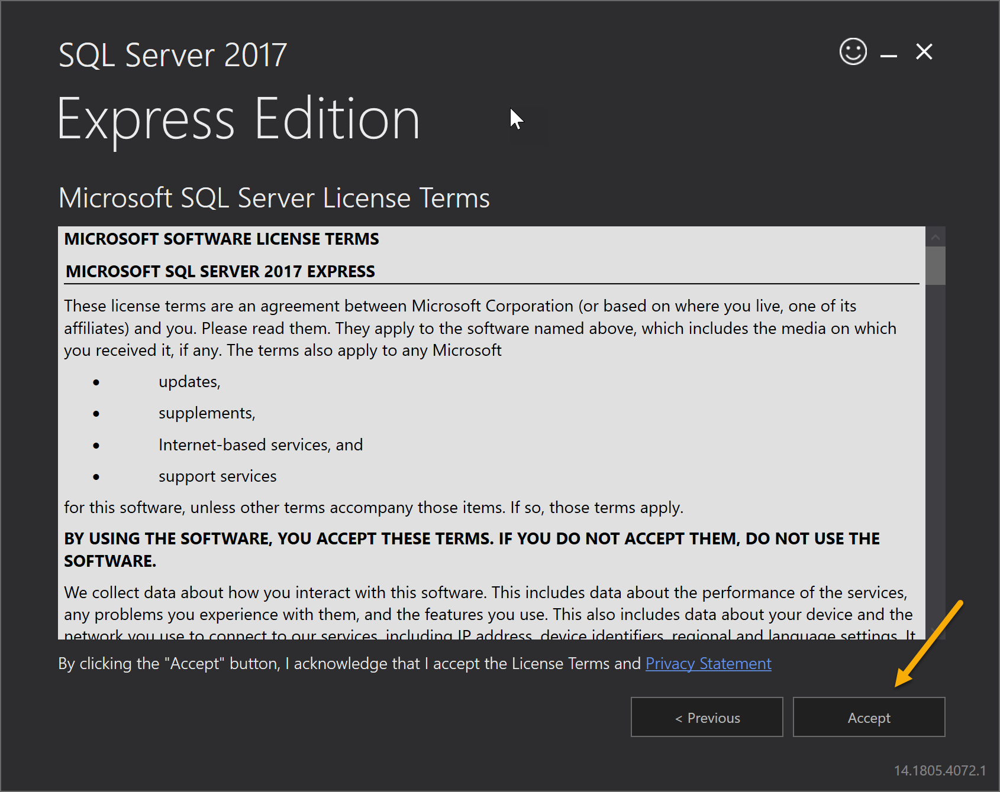
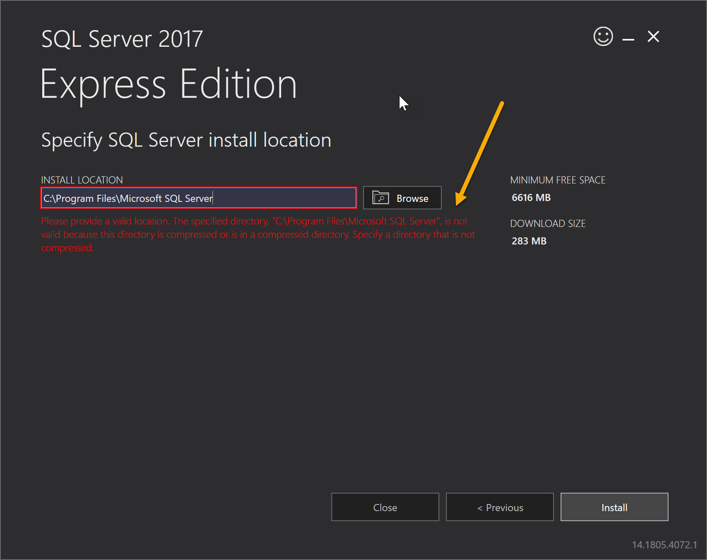
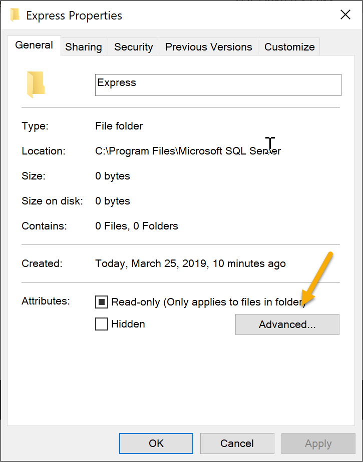
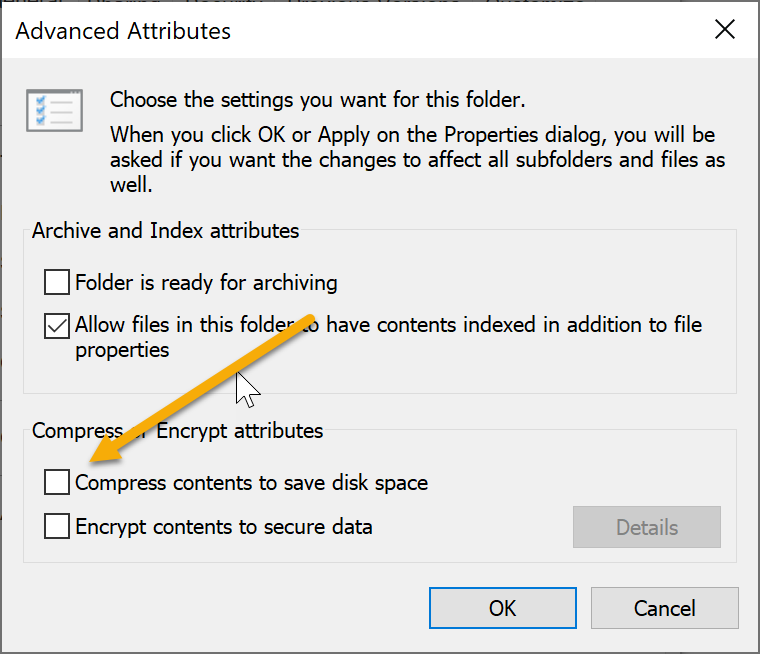
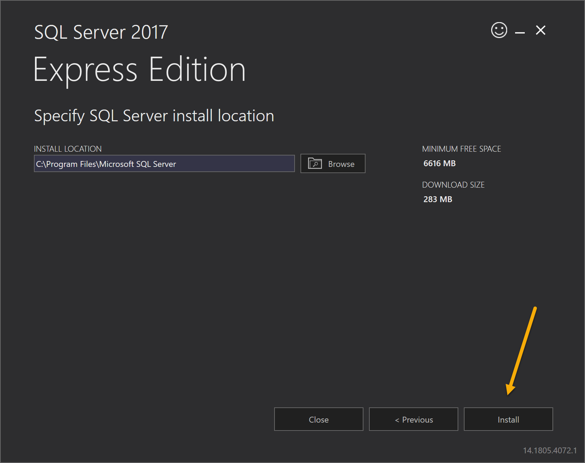
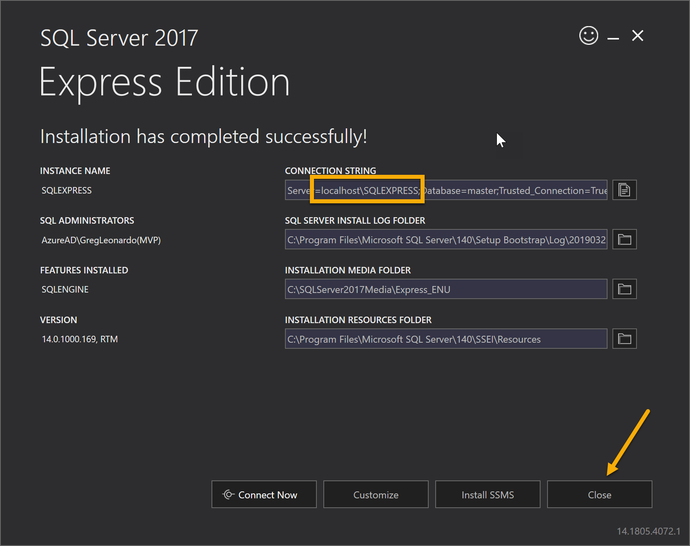

# SQL Express Installation Instructions

#### Select Basic

#### What to do when you get the drive compression error.

#### Do the following for both of your SQL directories in "Program Files" and "Program Files(x86)

#### Remove the checkmark to turn of compression in this directory only as you see below.

#### Then continue with the install

#### Male note of your SQL Express instance name and close installer

